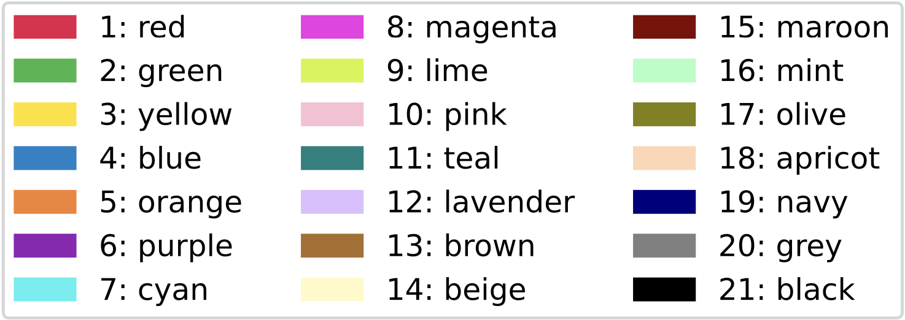

  

This repository is a stand-alone copy of GFViewer. Anyone can run GFViewer locally in their machines just by cloning this.

# Installation
GFViewer can be either installed as a conda package or executed directly from the source.

# Conda installation
You will need conda installed in your machine to proceed. If you don't have conda installed, please follow [conda installation](https://conda.io/docs/user-guide/install/). If you already had it installed, please make sure it is updated.

Create a conda environment first:

`conda create -n gfviewer_env python=3.12`

This will create a conda environment named gfviewer_env with python version 3.12. Then activate the environment with:

`conda activate gfviewer_env`

Finally, install the [gfviewer](https://anaconda.org/bioconda/gfviewer) package using the following command:

`conda install bioconda::gfviewer`

# Installation from the source
For installation from the source, GFViewer requires python version (>=3.8, <3.13) and pip installed first. If you don't have them installed, execute the following commands:

For Ubuntu/Debian (using apt):
<pre>
sudo apt update
sudo apt install python3.x 
sudo apt install python3-pip
</pre>

For macOS (using Homebrew):
<pre>
brew install python@3.x
brew install python-pip
</pre>

Here, `x = {8,9,10,11,12}`.

To verify installation:
<pre>
python --version
pip --version
</pre>

There are many other ways to install them. You can adopt any one of them at your own accord.

If you have python and pip already installed, open the terminal and follow the steps below:
<pre>
cd ~
git clone https://github.com/sakshar/GFViewer.git
cd GFViewer
pip install -r requirements.txt
</pre>

# Scripts
- `gfviewer/main.py` contains the source codes for GFViewer

- `test_run.sh` contains the commands to execute GFViewer on the provided sample test cases

# Required data format
- **Gene-family Data File:** A file (.xlsx/.csv/.tsv) containing gene family and location information for each gene that must maintain the structure as follows:

|  gene_id  | gene_family | chromosome | start |  end  | strand |
|-----------|-------------|------------|-------|-------|--------|
| gene_1    | family_1    | chr_1      | 4031  | 15104 | -      |
| gene_2    | family_2    | chr_2      | 24310 | 45159 | +      |
| ...       | ...         | ...        | ...   | ...   | ...    |
| centro_1  | centromere  | chr_1      | 82125 | 98476 | 0      |

The naming convention for the header row must be followed strictly. If you want to plot the centromeres along with genes belonging to different gene-families, always put **centromere** under **gene_family** and **0** under **strand** columns.

- **Genome or Chromosome-Lengths File:** A fasta (.fasta/.fna/.fa) file containing the genome sequence or a text (.txt) file containing the chromosome ids with their lengths; seq_id,seq_length per line:
<pre>
chr_1,length_of_chr_1
chr_2,length_of_chr_2
...
</pre>

- **Color Map File:** A text (.txt) file contating the gene family (gf) ids with their color codes; gf_id,color_code or gf_id,[0,1],[0,1],[0,1] per line (RGB values):

If assigning colors based on provided color code, structure the color map file as follows:
<pre>
gf_1,1
gf_2,2
...
</pre>

This will assign **red** to **gf_1**, **green** to **gf_2** and so on.

For color assignment of gene-families using the provided color code, refer to the following palette:

  

If assigning colors based on your own choice, provide the corresponding RGB values for each gene family as follows:
<pre>
gf_1,0.x,0.y,0.z
gf_2,0.i,0.j,0.k
...
</pre>

# Execution
For executing as a conda package:
<pre>
gfviewer [-h] -d DATA_FILE -g GENOME_FILE -o OUTPUT_DIRECTORY \
                [-c COLOR_MAP_FILE] [-l LEGEND_LOCATION] [-or LEGEND_ORIENTATION] \
                [-t TELOMERE_LENGTH] [-p NUMBER_OF_CHROMOSOMES_PER_PAGE] \
                [-r NUMBER_OF_ROWS_IN_LEGENDS] [-cen] [-lpp] [-conc]
</pre>

For executing from the source, first go to the directory where you cloned the repository. For example, if you have cloned the repository in your home directory:
<pre>
cd ~/GFViewer
python gfviewer/main.py [-h] -d DATA_FILE -g GENOME_FILE -o OUTPUT_DIRECTORY \
                [-c COLOR_MAP_FILE] [-l LEGEND_LOCATION] [-or LEGEND_ORIENTATION] \
                [-t TELOMERE_LENGTH] [-p NUMBER_OF_CHROMOSOMES_PER_PAGE] \
                [-r NUMBER_OF_ROWS_IN_LEGENDS] [-cen] [-lpp] [-conc]
</pre>

Description of the different arguments and options:
<pre>
required:
  -d DATA_FILE, --data_file DATA_FILE
                        A file (.xlsx/.csv/.tsv) containing gene family and location
                        information for each gene
  -g GENOME_FILE, --genome_file GENOME_FILE
                        A fasta (.fasta/.fna/.fa) file containing the genome sequence
                        or a text (.txt) file containing the chromosome ids with their
                        lengths; seq_id,seq_length per line
  -o OUTPUT_DIRECTORY, --output_directory OUTPUT_DIRECTORY
                        Path to the output directory
optional:
  -c COLOR_MAP_FILE, --color_map_file COLOR_MAP_FILE
                        A text (.txt) file containing the gene family (gf) ids with
                        their color codes; gf_id,color_code or
                        gf_id,[0,1],[0,1],[0,1] per line (default: assigns color codes to gene-families in sequential order)
  -l LEGEND_LOCATION, --legend_location LEGEND_LOCATION
                        Specify the location (upper/lower/left/right) of legends only
                        when adding them to each page (default: lower)
  -or LEGEND_ORIENTATION, --legend_orientation LEGEND_ORIENTATION
                        Specify the orientation (horizontal/vertical) of legends only
                        when plotting legends separately (default: horizontal)
  -t TELOMERE_LENGTH, --telomere_length TELOMERE_LENGTH
                        The length of telomeres in bp used in the plot (default: 10000)
  -p NUMBER_OF_CHROMOSOMES_PER_PAGE, --number_of_chromosomes_per_page NUMBER_OF_CHROMOSOMES_PER_PAGE
                        Number of chromosomes to be plotted per page (default: 3)
  -r NUMBER_OF_ROWS_IN_LEGENDS, --number_of_rows_in_legends NUMBER_OF_ROWS_IN_LEGENDS
                        Number of rows in the legends (default: 2)
  -cen, --centromeres   Plot centromeres of the chromosomes along with multi gene
                        families
  -lpp, --legends_per_page
                        Plot legends per page in the PDF
  -conc, --concatenate_pages
                        Concatenate the pages into a single PDF file
  -h, --help            show this help message and exit
</pre>

The plots are generated inside `OUTPUT_DIRECTORY/plot` and the genebank (.gb) files corresponding to the provided **DATA_FILE** are stored inside `OUTPUT_DIRECTORY/tmp`.

# Example run
To execute the sample test cases, clone the repository and move to the repository directory:
<pre>
cd ~
git clone https://github.com/sakshar/GFViewer.git
cd GFViewer
</pre>

The provided sample test cases can be found inside the `tests` directory.

For test case 1:
<pre>
# if installed as a conda package
gfviewer -d tests/data_test_1.xlsx -g tests/chrs_test_1-2.txt -o out_test_1 -c tests/colors_test_1.txt

# if executing from the source
gfviewer/main.py -d tests/data_test_1.xlsx -g tests/chrs_test_1-2.txt -o out_test_1 -c tests/colors_test_1.txt
</pre>
This will generate the plots inside `out_test_1/plot` where the legends will be generated separately as `out_test_1/plot/legends.pdf`.

For test case 2:
<pre>
# if installed as a conda package
gfviewer -d tests/data_test_2.csv -g tests/chrs_test_1-2.txt -o out_test_2 -c tests/colors_test_2.txt -p 1 -r 1 -lpp -conc

# if executing from the source
gfviewer/main.py -d tests/data_test_2.csv -g tests/chrs_test_1-2.txt -o out_test_2 -c tests/colors_test_2.txt -p 1 -r 1 -lpp -conc
</pre>
This will generate the plot as a single file named `mgf.pdf` with legends arranged in a single row at the bottom inside `out_test_2/plot` where each page will contain a single chromosome.

For test case 3:
<pre>
# if installed as a conda package
gfviewer -d tests/data_test_3.tsv -g tests/chrs_test_3.fasta -o out_test_3 -cen -lpp

# if executing from the source
gfviewer/main.py -d tests/data_test_3.tsv -g tests/chrs_test_3.fasta -o out_test_3 -cen -lpp
</pre>
This will generate the plots including the centromere for each chromosome inside `out_test_3/plot` and the colors will be assinged to each gene family based on the default color code of GFViewer in sequential order.

# Questions
Email: stelo@cs.ucr.edu

<!-- # Citation
Sakshar Chakravarty and Stefano Lonardi. 2025. GFViewer: A tool for visualizing the localization of multi-gene families across the genome. Journal. doi: https://doi.org/nn.nnnn/2025.nn.nn.nnnnnn -->
