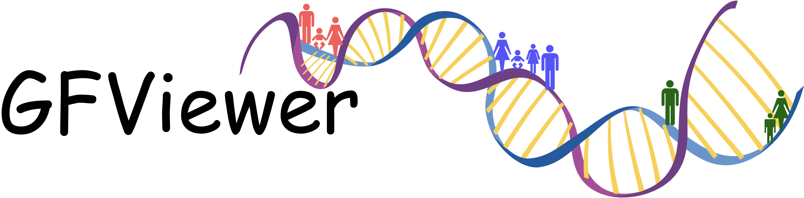

<p align="center">
  
</p>

Visualize the localization of **multigene families** across the chromosomes of a
genome, and quantify how those families are distributed.

GFViewer draws round-capped chromosome ideograms with each family in its own
colour (``+`` strand above the axis, ``-`` below), optionally marks centromeres,
and can compute localization statistics. Output is fully vector and can be saved
as **PDF, SVG, PNG, JPG, TIFF or EPS**.

Version 2 rewrites the rendering engine on top of matplotlib (the old
BioPython/`BasicChromosome` engine is kept at `gfviewer.legacy` for one
release), removes the 19-family ceiling, adds BED / GFF3 / GTF input, a style
system, an analytics module, and an interactive web portal.

## Install

```bash
pip install gfviewer                      # the `gfviewer` command-line tool
```

From a source checkout (development, tests, or the web portal):

```bash
conda env create -f environment.yml      # or: python -m venv .venv && source .venv/bin/activate
conda activate gfviewer
pip install -e ".[web,dev]"               # editable, with Flask + pytest
```

A full pip-installation and command-line walkthrough — isolated environments,
every flag with worked examples, troubleshooting — is in
[`docs/INSTALL.md`](https://github.com/sakshar/GFViewer/blob/main/docs/INSTALL.md),
and is mirrored on the web portal's **Install** page. Build distributable
artifacts with `scripts/build_wheel.sh`.

## Command line

```bash
gfviewer -d genes.tsv -g genome.fasta -o out/ \
         -f pdf svg png --analytics -cen \
         --tick-style lollipop --title "My organism"
```

Key options (`gfviewer --help` for the full list):

| Flag | Meaning |
|------|---------|
| `-d/--data` | one or more annotation files (`.xlsx/.csv/.tsv/.bed/.gff3/.gtf`) |
| `-g/--genome` | FASTA, `.fai`, `chrom.sizes`, or `chrom,length` table |
| `-c/--colors` | colour-map file (`family,index` / `family,#hex` / `family,r,g,b`) |
| `-m/--mapping` | `gene_id,gene_family` map (single BED/GFF input) |
| `--family-attr` | GFF3/GTF attribute that holds the family |
| `-f/--format` | export formats |
| `--collapse-rare` | fold infrequent families into "Other" above the 40-family cap |
| `--style` / `--save-style` | load / write a YAML/JSON style file |
| `--analytics` | also write per-family statistics as CSV/JSON |
| `--no-titles` | omit titles from the exported figure and analytics-chart images |
| `-cen` | draw centromeres |

### Input formats

* **Table** — columns `gene_id, gene_family, chromosome, start, end, strand`
  (1-based, inclusive; header synonyms accepted). A `centromere` value in
  `gene_family` (strand `0`) marks a centromere.
* **BED** — 0-based half-open, converted automatically. One file → column 4 is
  the family; several files → each file's base name is the family; one file plus
  a mapping file → family from the map.
* **GFF3 / GTF** — 1-based; gene-like feature types kept; family taken from
  `--family-attr` (default search: `gene_family`, `Family`, `gene_biotype`,
  `Name`, …).

### Analytics

`--analytics` writes `analytics_*.csv` / `.bed`, `analytics_summary.json` and
four figures (`analytics_genes_per_family`, `analytics_positional_profile`,
`analytics_ripley`, `analytics_family_proximity` — one per requested figure
format). It computes:

* per-family counts split into genes on chromosomes vs. unplaced/stray contigs,
  linear density, gene length, strand fraction;
* permutation tests for **telomere-** and (with a centromere track)
  **centromere-proximal** bias, plus **p-arm / q-arm** occupancy;
* **tandem-array** detection and a **tandem / proximal / dispersed** duplication
  mode per family;
* **multi-scale clustering** — edge-corrected 1-D **Ripley's K/L** with a
  permutation envelope (`--ripley-scales`);
* **chromosome-enrichment** (binomial, per family × chromosome), **strand bias**,
  and per-chromosome **family diversity** (Shannon / evenness);
* a binned **positional density profile** ("metachromosome" plot);
* a **family × family proximity matrix** with average-linkage clustering;
* **multigene-family hotspots** — a Poisson window scan, merged and written as a
  table and a **BED** file (`--hotspot-window`);
* optional pairwise **co-localization** (`--colocalization`).

Every per-family / per-pair / per-window test carries a Benjamini–Hochberg
`q_value`. See the
[*Downloadable outputs*](https://github.com/sakshar/GFViewer/blob/main/templates/help.html)
section of the Help page for the column-by-column layout of each file.

## Web portal

```bash
# development
python flaskapp.py                       # http://localhost:5001

# production
gunicorn -w 1 --threads 4 -b 0.0.0.0:5001 "gfviewer_web:create_app()"
```

Uploads are rendered on a background thread pool behind an async job API
(`POST /api/jobs` → `GET /api/jobs/<id>/status` → results page). The results page
embeds the SVG with an editor for choosing which families and chromosomes to
draw, recolouring, moving the legend and labels, changing fonts and mark style,
toggling whether titles are baked into the image files, then re-rendering and
exporting. Analytics figures are shown inline, and two buttons download
**everything as a ZIP** — either as produced, or re-rendered in every figure
format. `GET /api/health` is a readiness probe.

**Usage monitor.** A privacy-respecting counter (`/stats`, or JSON at
`/api/stats`) tracks page views, unique visitors per day (a salted daily hash —
no IPs, cookies or other personal data are stored), jobs submitted / completed /
failed, example-dataset runs and downloads, with a rolling ~120-day daily
series. Counters persist to `instance/usage.json`.

Configuration (environment variables): `GFVIEWER_DATA_DIR`,
`GFVIEWER_MAX_UPLOAD_MB` (25), `GFVIEWER_WORKERS` (2), `GFVIEWER_JOB_TTL_HOURS`
(24), `GFVIEWER_USAGE_FILE`, `GFVIEWER_STATS_TOKEN` (require `?token=` on
`/stats`), `SECRET_KEY`, `PORT`.

## Example datasets

`python tests/make_fixtures.py` builds every bundled dataset into
`static/tests/`: the three *Babesia* sets, the 6-family set re-expressed in
every input format (`formats/` — BED, per-family BED, BED + mapping, GFF3, GTF),
and two synthetic sets — 10 random gene families on the *Arabidopsis* (TAIR10)
chromosomes and 20 on *C. elegans* (WBcel235). The web home page lists them all
with **Run** (submits the job) and **Download** buttons, plus *Download every
dataset (ZIP)*.

## Tests

```bash
python tests/make_fixtures.py            # once, to build the example datasets
pytest -q
```

## Citation

Chakravarty S. & Lonardi S. *Visualizing the localization of multigene families
with GFViewer.* Development supported by NIH grant 1-R01-AI169543-01.
